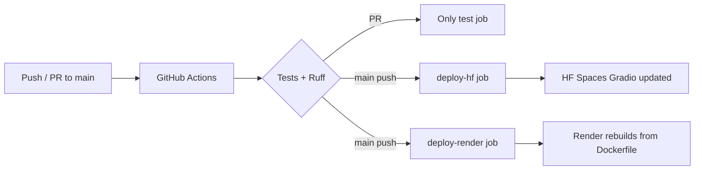

# RAG Document Q&A

[](https://github.com/RahulRachhoya/rag-document-qa/actions/workflows/ci.yml)
[](https://www.python.org/downloads/release/python-3110/)
[](LICENSE)
[](https://huggingface.co/spaces/RahulRachhoya/rag-document-qa)

Production-grade Retrieval Augmented Generation (RAG) system that answers questions from uploaded documents using hybrid search and Groq LLM.

## Features

- **Hybrid retrieval**: dense cosine search (Qdrant) + BM25 sparse search fused with Reciprocal Rank Fusion (RRF)
- **Cross-encoder reranking**: top-20 candidates reranked by `cross-encoder/ms-marco-MiniLM-L-6-v2`
- **Groq LLM**: Llama-3.3-70b-versatile for fast, free inference
- **Multi-format ingestion**: PDF, DOCX, TXT, Markdown
- **In-memory Qdrant**: zero config for demo; pluggable for cloud Qdrant
- **FastAPI backend**: REST endpoints for upload, list, delete, query
- **Gradio demo**: hosted on Hugging Face Spaces

## Architecture

```
PDF / DOCX / TXT
       |
       v
  [DocumentLoader]
   pypdf / python-docx
       |
       v
  [RecursiveChunker]
   512 tokens / 64 overlap
       |
       v
  [MiniLM Embedder]
   all-MiniLM-L6-v2
      / \
     /   \
    v     v
[Qdrant]  [BM25]
 cosine   Okapi
    \     /
     \   /
      v v
  [RRF Fusion]
  1/(k + rank)
       |
       v
[Cross-Encoder Rerank]
 ms-marco-MiniLM-L-6-v2
       |
       v
  [Groq LLM]
  Llama-3.3-70b-versatile
       |
       v
    Answer
```

## Quick Start

```bash
git clone https://github.com/RahulRachhoya/rag-document-qa.git
cd rag-document-qa

# Install
pip install -e ".[dev]"

# Set your Groq key (free at console.groq.com)
echo "GROQ_API_KEY=gsk_..." > .env

# Run the API
uvicorn rag_qa.api.main:app --reload

# Or run the Gradio demo locally
python hf_demo/app.py
```

## API Endpoints

| Method | Path | Description |
|--------|------|-------------|
| GET | `/health` | Health check |
| POST | `/documents/upload` | Upload and ingest a document |
| GET | `/documents/` | List all documents |
| DELETE | `/documents/{doc_id}` | Delete a document |
| POST | `/query/` | Ask a question |

### Example

```bash
# Upload a document
curl -X POST http://localhost:8000/documents/upload \
  -F "file=@myreport.pdf"

# Ask a question
curl -X POST http://localhost:8000/query/ \
  -H "Content-Type: application/json" \
  -d '{"question": "What are the main findings?", "top_k": 5}'
```

## Project Layout

```
src/rag_qa/
  config.py          pydantic-settings BaseSettings
  models.py          Pydantic request/response models
  pipeline.py        RAGPipeline (ingest + query)
  services/
    loader.py        PDF/DOCX/TXT document loading
    chunker.py       Recursive character text splitter
    embedder.py      SentenceTransformers all-MiniLM-L6-v2
    vector_store.py  Qdrant client (in-memory or cloud)
    retriever.py     Hybrid dense + BM25 + RRF
    reranker.py      Cross-encoder reranking
    llm.py           Groq Llama chat completion
  api/
    main.py          FastAPI app
    routes/
      health.py
      documents.py
      query.py
tests/unit/          Mock-based pytest suite (no API keys needed)
hf_demo/app.py       Gradio two-tab demo for HF Spaces
```

## Running Tests

```bash
pytest tests/unit -v
```

Tests use mocked LLM calls and in-memory Qdrant -- no API keys required.

## Environment Variables

| Variable | Default | Description |
|----------|---------|-------------|
| `GROQ_API_KEY` | (required) | Groq API key from console.groq.com |
| `GROQ_MODEL` | `llama-3.3-70b-versatile` | Groq model name |
| `QDRANT_URL` | `""` (in-memory) | Qdrant cloud URL |
| `QDRANT_API_KEY` | `""` | Qdrant cloud API key |
| `CHUNK_SIZE` | `512` | Characters per chunk |
| `CHUNK_OVERLAP` | `64` | Overlap between chunks |
| `RERANKER_ENABLED` | `true` | Enable cross-encoder reranking. **In free Render IaC (`render.yaml`)** this is overridden to `false` by default to avoid OOM on the 512MB tier. Set to `true` locally or on paid plans if desired. |

## HF Spaces Demo

Live demo: [huggingface.co/spaces/RahulRachhoya/rag-document-qa](https://huggingface.co/spaces/RahulRachhoya/rag-document-qa)

To deploy your own:
1. Fork this repo
2. Add `HF_TOKEN` as a GitHub Actions secret (a personal HF token with write permissions to Spaces; you must create and maintain this yourself)
3. Push to `main` -- CI will deploy automatically

**HF_TOKEN note (very important):** `HF_TOKEN` is used *only* by the GitHub Actions CI job (`deploy-hf`) to push the Gradio demo to Hugging Face Spaces. It is **not required or used at runtime** for the Render FastAPI service, local runs, or the live `/query/` etc. endpoints. The Render API deployment works completely without any HF_TOKEN. See also the note in `tests/live/test_full_live_pipeline.py` and `render.yaml` comments.

## Free Deployment (Showcase Your Skills)

This project is designed to be deployed completely for free so you can share a live API + beautiful demo in your portfolio.

**Recommended free stack (2026):**
- **Backend API** → [Render.com](https://render.com) free web service (Docker)
- **Gradio UI** → Hugging Face Spaces (already automated)
- **CI/CD** → GitHub Actions (tests + deploy both targets on every push to `main`)

### Why this combination?
- Render offers a true free tier for Docker web services (no credit card required).
- GitHub Actions is free/unlimited for public repos.
- You get two public URLs: a real FastAPI + the polished Gradio interface.
- Declarative `render.yaml` shows Infrastructure-as-Code skills.

### One-time Setup (Render + Secrets)

1. **Create a free Render account** at https://dashboard.render.com/register
2. In Render:
   - New > Web Service
   - Connect your GitHub repo (`rag-document-qa`)
   - Render should auto-detect the `Dockerfile` and `render.yaml`
   - Choose **Free** instance type
   - In the Environment section add your secrets and vars (use **Secret** type for keys in the Render UI):
     - `GROQ_API_KEY` as a secret (get a free key at https://console.groq.com/keys)
     - `GROQ_MODEL=llama-3.3-70b-versatile` (or leave default; `render.yaml` also sets this)
     - (The `render.yaml` IaC also forces `RERANKER_ENABLED=false` for the free tier -- see below)
   - Deploy. Your API will be live at `https://your-service-name.onrender.com`
3. (Recommended) Create a Deploy Hook:
   - Go to your service → Settings → Deploy Hook
   - Copy the long URL
   - In your GitHub repo go to Settings → Secrets and variables → Actions
   - Add new secret: `RENDER_DEPLOY_HOOK` = the URL you copied

### How the Full CI/CD Works



- Every PR/push: runs the `test` job (lint + `pytest tests/unit`).
- Push to `main`:
  - After tests pass → `deploy-hf` (existing) updates your HF Space.
  - After tests pass → `deploy-render` curls your `RENDER_DEPLOY_HOOK` (new) → Render starts a new deploy using the `render.yaml` + `Dockerfile`.

You can also connect the repo directly in Render for auto-deploys; the hook gives you explicit control from CI.

### Limitations of the Free Tier (be honest in your showcase)

- **Spin-down**: Render free instances sleep after ~15 minutes of inactivity. First request after sleep has a cold start (10-40s while the embedding model downloads).
- **Ephemeral storage**: In-memory Qdrant means any documents you upload are lost when the instance restarts. This is fine for a demo ("upload a doc and ask questions right now").
- **Resource limits / 512MB issue**: Free tier has modest CPU/RAM (~512MB). The embedding model + (if enabled) cross-encoder reranker + Torch can easily trigger OOM on cold starts or concurrent load. 
  **Fixes applied via IaC + Dockerfile** (see `render.yaml` comments and `Dockerfile` for details):
  - **Reranker disabled by default in free IaC**: `render.yaml` sets `RERANKER_ENABLED=false` (saves substantial RAM; the reranker is still available on paid tiers or locally by overriding the env var).
  - CPU-only Torch wheel in Dockerfile (installed from https://download.pytorch.org/whl/cpu before project deps so sentence-transformers uses the slim CPU variant, avoiding CUDA libs).
  - Thread limits in Dockerfile: `OMP_NUM_THREADS=1`, `MKL_NUM_THREADS=1`, `OPENBLAS_NUM_THREADS=1`, `NUMEXPR_NUM_THREADS=1`, `TOKENIZERS_PARALLELISM=false`.
  - Single worker: `uvicorn ... --workers 1`.
  - Explicit `device="cpu"` in `src/rag_qa/services/embedder.py` and `reranker.py`.
  - Models lazy-load on first use / cold start.
- **No custom domain** on free (you get a nice `onrender.com` subdomain).

These are standard for truly free tiers and show you understand production trade-offs. The declarative `render.yaml` + these mitigations demonstrate solid IaC and ops awareness.

### OOM Troubleshooting (512MB Free Tier)

If you see out-of-memory errors (500s on cold start, "Killed" in Render logs, or healthcheck failures during model load):

1. **Confirm reranker is disabled on your Render service**: In Render dashboard → Environment, ensure `RERANKER_ENABLED` is absent or explicitly `false`. The committed `render.yaml` sets it to `false` for the free plan. Re-deploy after changing `render.yaml` if you edited it.
2. **Check the Dockerfile mitigations are present** (CPU torch install, thread env vars, `--workers 1`).
3. **Warm-up / cold start**: First request after sleep can take 30-90s (model download + load). The live tests and health checks include warm-up retries. Use `/health` endpoint.
4. **Reduce load**: Free tier is single-core-ish; avoid parallel test clients or very large docs during initial testing.
5. **Monitor logs**: In Render dashboard, look for "OOM", "Memory limit", "torch", or "sentence-transformers" lines.
6. **Upgrade path (if demo succeeds)**: Move to Render paid Starter plan or self-host. Or disable reranker + keep using free (recommended for portfolio demos).
7. **Local reproduction**: `RERANKER_ENABLED=true` locally (or in Docker without the CPU/thread caps) will use more RAM but should not OOM on a dev machine.

See also `render.yaml` (top comments), `Dockerfile`, `src/rag_qa/config.py`, and the live test file for related notes. The 512MB constraints + fixes are intentional and fully documented so forks can reproduce a working free deployment.

### Using Your Deployed Services

- **API**: `https://<your-render-service>.onrender.com`
  - `GET /health`
  - `POST /documents/upload` (multipart file)
  - `POST /query/` (JSON `{ "question": "...", "top_k": 5 }`)
- **Gradio UI**: Your existing HF Space (or the one auto-deployed by CI).

You can even point the Gradio demo at the live Render API later by changing a few lines in `hf_demo/app.py` (optional enhancement).

### Alternative Free Platforms

If you prefer not to use Render, the same pattern works with:
- **Fly.io** (add a `fly.toml` + GitHub Action using `flyctl`)
- **Railway** (great DX, but free tier changed to usage-based credits in 2023+)

Render currently gives the most generous "set and forget" free Docker tier for demos in 2026.

### Beautiful & Usable Frontend (ui/index.html)

In addition to the API and the Gradio demo, this repo now ships a **modern, production-feeling single-file UI** (`ui/index.html`):

- Two-panel responsive layout (Documents + Ask)
- Drag & drop uploads + real-time document cards with delete
- Clean question input + top-k slider
- Nicely formatted answers + source cards (filename, chunk #, relevance score, full snippet)
- Live API base override (pre-filled with your Render URL)
- Toasts, spinners, empty states, keyboard support
- Zero build step (Tailwind via CDN)

**On the live deployment** (https://rag-document-qa-22uh.onrender.com), the root path now serves this nice UI automatically.

You can also open it locally:
```bash
# macOS
open ui/index.html
# Windows
start ui/index.html
# Linux
xdg-open ui/index.html
```

Make sure the "API" field points at your Render URL (or your local dev server).

This is the primary "user-facing" experience people will see when you share the link — clean, intuitive, and showcases the full feature set properly.

---

## License

MIT
